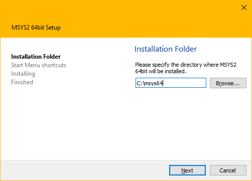

# MSYS2 Installer & Archives

The [MSYS2 installer](https://github.com/msys2/msys2-installer) can be used to
set up an initial MSYS2 environment. For further updating pacman is used. See
[the updating guide](./updating.md) for more information.



The installer comes in three variants:

* `msys2-x86_64-.exe`: The GUI installer (see screenshot above)
* `msys2-base-x86_64-*.sfx.exe`: Just the files in a self extracting archive (missing Windows integration like shortcuts, uninstall entry, but otherwise works the same)
* `msys2-base-x86_64-*.tar.xz`: Same as `.sfx.exe` but as an XZ archive

The installer executables and tarballs are hosted on
[GitHub](https://github.com/msys2/msys2-installer/releases) as well as on the
[repo server](https://repo.msys2.org/distrib). We also provide [nightly
builds](https://github.com/msys2/msys2-installer/releases/tag/nightly-x86_64).

## CLI Usage Examples

The GUI installer utilizes the [Qt Installer
Framework](https://doc.qt.io/qtinstallerframework/) which also offers CLI
options for automation.

Installing the GUI installer via the CLI to `C:\msys64`:

```powershell
.\msys2-x86_64-latest.exe in --confirm-command --accept-messages --root C:/msys64
```

Uninstalling an existing installation in `C:\msys64` via the CLI:

```powershell
C:\msys64\uninstall.exe pr --confirm-command
```

Installing the self extracting archive to `C:\msys64`:

```powershell
.\msys2-base-x86_64-latest.sfx.exe -y -oC:\
```

## FAQ

### What's the difference between the installer and the archives?

The installer provides some additional features such as installing shortcuts, registering an uninstaller, a GUI for selecting the installation path and automatically running a login shell at the end to initialize the MSYS2 environment.

If you unpack the archives and run a login shell once, you will get a functionally equivalent MSYS2 installation.

### What is contained in the installer/archives?

It contains the [base](https://packages.msys2.org/package/base) package and all its dependencies. You can list the contained packages using: `pactree base -lu | sort`

### How can I verify the basic integrity of the downloaded files?

You can download the expected checksum by appending `.sha256` to each download URL. You can verify that the downloaded file matches the checksum by computing the checksum either with Powershell:

```powershell
(Get-FileHash -Algorithm SHA256 -Path .\msys2-x86_64-20230526.exe).Hash.toLower()
432dcc8b5cc7d5104a85b52df8b1e77cdf91018e102ac7aa998248637d636229
```

or with 7-Zip, if you have it installed:

* Right clicking on `msys2-x86_64-20230526.exe`
* Go into the "7-Zip" and then "CRC SHA" sub menu, and finally click on "SHA-256"
* 7-Zip will pop up a window containing the checksum

Compare the result with the content of "https://github.com/msys2/msys2-installer/releases/download/2023-05-26/msys2-x86_64-20230526.exe.sha256" to verify that your local file matches the checksum.

### How can I verify that the downloaded files were generated by MSYS2 developers?

The installer is signed using the following key:

[`0EBF 782C 5D53 F7E5 FB02  A667 46BD 761F 7A49 B0EC`](http://keyserver.ubuntu.com/pks/lookup?search=0x0ebf782c5d53f7e5fb02a66746bd761f7a49b0ec&fingerprint=on&op=vindex)

You can download the signature by appending a `.sig` to all download URLs.

Verification example:

```console
$ gpg --keyserver keyserver.ubuntu.com --recv "0EBF 782C 5D53 F7E5 FB02  A667 46BD 761F 7A49 B0EC"
gpg: key 46BD761F7A49B0EC: public key "Christoph Reiter <reiter.christoph@gmail.com>" imported
gpg: Total number processed: 1
gpg:               imported: 1
$ ls
msys2-x86_64-20230526.exe  msys2-x86_64-20230526.exe.sig
$ gpg --verify msys2-x86_64-20230526.exe.sig
gpg: assuming signed data in 'msys2-x86_64-20230526.exe'
gpg: Signature made Fr 26 Mai 2023 11:46:54 CEST
gpg:                using RSA key E0AA0F031DBD80FFBA57B06D5A62D0CAB6264964
gpg: Good signature from "Christoph Reiter <reiter.christoph@gmail.com>" [unknown]
gpg: WARNING: This key is not certified with a trusted signature!
gpg:          There is no indication that the signature belongs to the owner.
Primary key fingerprint: 0EBF 782C 5D53 F7E5 FB02  A667 46BD 761F 7A49 B0EC
     Subkey fingerprint: E0AA 0F03 1DBD 80FF BA57  B06D 5A62 D0CA B626 4964
```

For the signature to be valid, gnupg has to print "Good signature" **and** the primary fingerprint shown has to match `0EBF 782C 5D53 F7E5 FB02  A667 46BD 761F 7A49 B0EC`.
